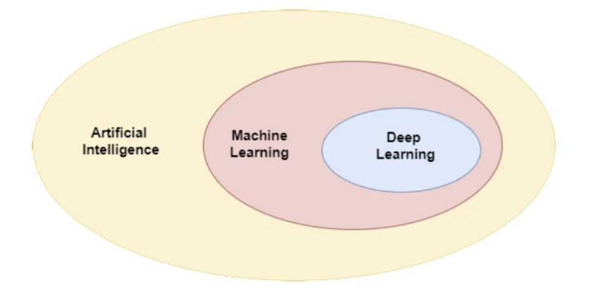
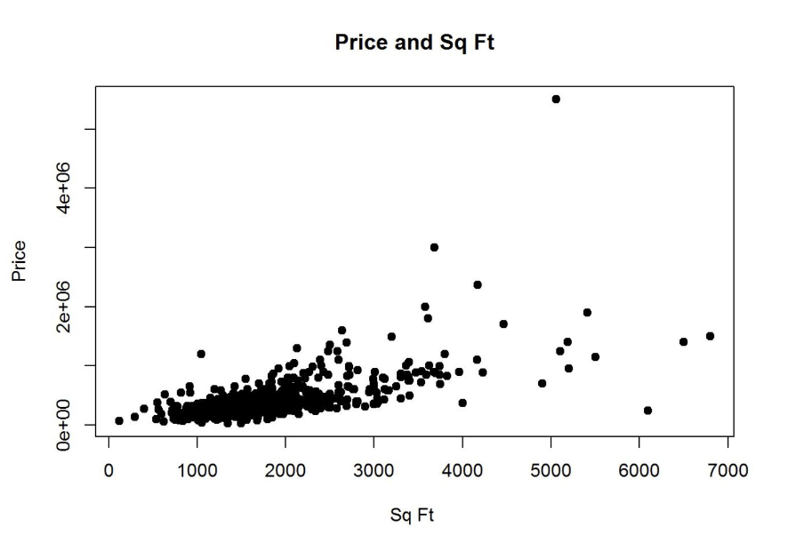
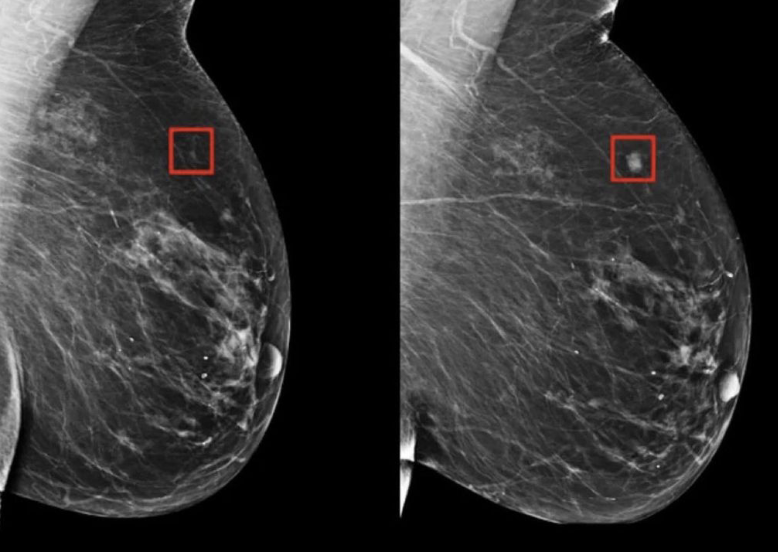

# Lecture 1: Introduction to Machine Learning (ML)

## What is Machine Learning?

> Machine learning is the science of getting computers 
to act without being explicitly programmed – Andrew Ng

 

## Artificial Intelligence

 

## What is Artificial Intelligence?

> Artificial intelligence (AI) is the broader field focused 
on creating machines capable of performing tasks that 
mimic human intelligence, such as reasoning, planning, 
and language understanding. Machine learning (ML), a 
subset of AI, specifically involves algorithms that 
enable machines to learn from data and improve 
automatically, without explicit programming for each 
task. – GPT-4o

 

## Structure of the course

1. Supervised Learning

    - Simple Linear Regression

    - Multiple Linear Regression

    - Logistic Regression

    - Regularisation Techniques

2. Deep Learning

    - Neural Networks

    - Convolutional Neural Networks

    - Transformers and Large Languages Models (LLMs)

3. Unsupervised Learning

4. Reinforcement Learning (RL)

 

## Supervised Learning

 

## Cancer Detection 5 Years in Advance

[Source](https://jamanetwork.com/journals/jamanetworkopen/fullarticle/2824353#:~:text=In%20this%20retrospective%20population%2Dbased,to%206%20years%20before%20diagnosis)

 

## Applications

 

| Application             | Input X             | Output Y      |
|-------------------------|---------------------|--------------|
| Email spam detection   | Emails              | spam or not  |
| Image Classification   | Images (mixed)      | Cat / Dog    |
| Self-driving car       | Images, sensors     | move or not  |
| House price prediction | Area, floors        | Price        |

 

---

