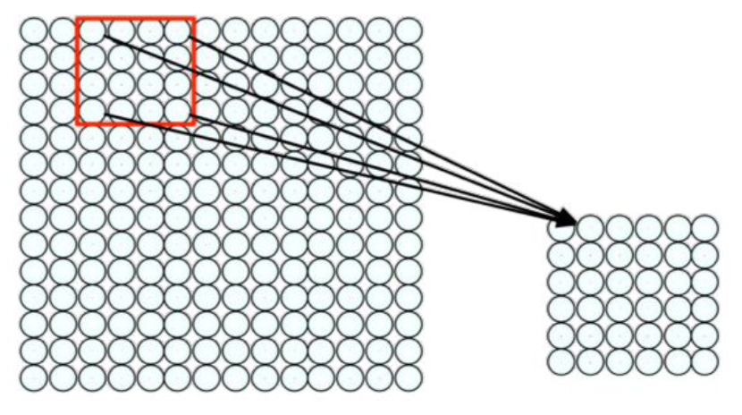
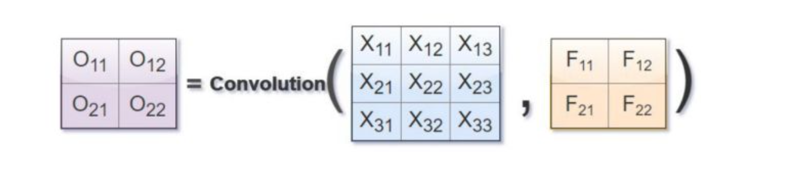

<div align="justify">

# Lecture 7: Convolutional Neural Networks (CNNs)


## Introduction to CNNs

> CNNs are a class of deep neural networks designed for image processing

- Key applications:

    - Image recognition

    - Object detection

    - Medical imaging

- Structure:

    

    - Consists of convolutional layers, pooling layers, fully connected layers

<br>

## How do we feed data into the model


<br>

## Convolutional Layers

- Purpose: Extracts spatial features from input images

- Convolution operation:

    - Uses a kernel (filter) to slide over the image

    - Computes dot product at each position

    - Produces feature maps

- Example:

    - 3 $\times$ 3 filter applied to a 5 $\times$ 5 image

- Activation function:
ReLU(Rectified Linear Unit) for non-linearity

- We usually add padding

<br>

## Kernel (filter) sliding over the image




<br>

## Resulting Matrix after applying the filter



Resulting Matrix = Convolution(Initial Data, Filter)

<br>

## Practical Numerical Example


<br>

## Use of an activation function to introduce non-linearity

Recall that ReLU makes negative inputs = 0


<br>

## Stride and Padding

- Stride: Defines the step size of the filter

    - Larger stride reduces spatial dimensions

    - "How many steps does it take the filter to go through the image"

- Padding:

    - Zero-padding preserves spatial dimensions

    - Used to avoid excessive size reduction

- Example: 5 $\times$ 5 input with a 3 $\times$ 3 filter and stride 2

<br>

### Stride


### Padding


It is common to add 0s to the edges of the images – otherwise, we are downsampling the image and losing

<br>


<br>

## Pooling Layers

- Purpose: Reduces spatial dimensions while retaining important features

- Types: 

    - Max pooling: Takes the maximum value from a region

    - Average pooling: Takes the average value

- Benefit: Reduces overfitting and computation cost

<br>


<br>

## Grayscale vs. Colour Images

- Grey Scale:

    - Single-channel (1D) input
    
    - Faster computation, less data

- Colour (RGB):

    

    - 3-channel (Red, Green, Blue) input

    - More complex feature extraction

<br>

- MNIST data set: 28 $\times$ 28 grayscale image vs. 28 $\times$ 28 $\times$ 3 RGB image

<br>

## Data Augmentation

Purpose: Increases dataset diversity to improve generalisation

- Techniques:
    
    - Rotation, flipping, zooming, brightness adjustment

    - Random cropping and noise addition

- Example: Original vs. augmented images

- Benefit: Reduces overfitting and improves model robustness

<br>


<br>

## Training Parameters in CNNs

Forward Pass:

- Input data (images) is passed through the network

- Each layer performs operations (convolution, activation, pooling)

- Outputs are generated for each layer

Loss Calculation:

- A loss function computes the error between predicted output and true labels

- The goal is to minimise this loss through training

<br>

Backward Pass:

- Backpropagation calculates gradients of the loss with respect to the network parameters

- Gradients indicate how to adjust the parameters (weights and biases) to reduce the error

<br>

Optimiser:

- Optimisers like SGD or Adam adjust the parameters based on the gradients

<br>


<br>

## Parameters Trained in Convolutional Neural Networks (CNNs)

Weights:

- The weights are the kernels (filters) applied to input data

Biases:

- Bias terms added to the output of the convolution before activation

Fully Connected Layer Parameters:

- Weights and biases of the fully connected (dense) layers at the end of the network

<br>

## PyTorch Implementation

```python
class CNN(nn.Module):
    def __init__(self):
        super(CNN, self).__init__()
        self.cnn_layers = nn.Sequential(
            nn.Conv2d(in_channels = 1, out_channels = 12, kernel_size = 3, padding = 1), nn.ReLU(), nn.MaxPool2d(kernel_size = 2),
            nn.Conv2d(in_channels = 12, out_channels = 24, kernel_size = 3, padding = 1), nn.ReLU(), nn.MaxPool2d(kernel_size = 2)
        )
        self.fc_layers = nn.Sequential(
            nn.Linear(in_features = 24 * 7 * 7, out_features = 64), nn.ReLU(), nn.Dropout(p = 0.2),
            nn.Linear(in_features = 64, out_features = 10)
        )

        def forward(self, x):
            x = self.cnn_layers(x) # Pass through convolutional layers
            x = x.view(x.size(0), -1) # Flatten the tensor to 1D
            return self.fc_layers(x) # Pass through fully connected layers
```

</div>