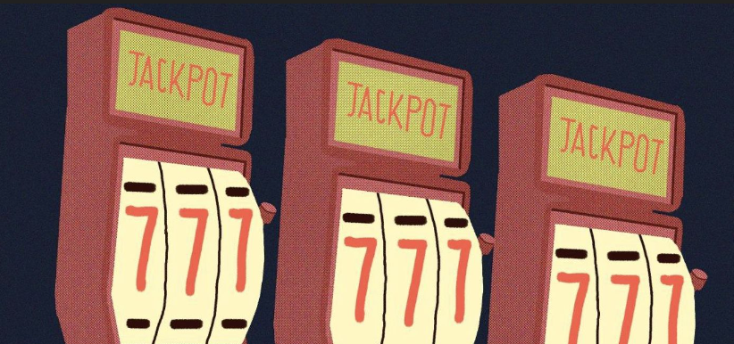
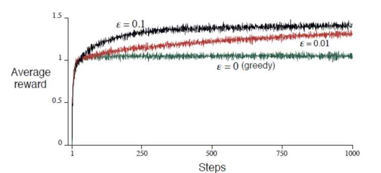

# Lecture 9: ε-Greedy k-Arm Bandit Problem

## What is the k-Arm Bandit Problem?

- Imagine a slot machine with k levels (arms)

- Each arm provides a random reward from an unknown distribution

- Goal: Maximise cumulative reward over a sequence of pulls

 

## Core Challenge: Exploration vs. Exploitation

- Exploration: Try different arms to learn about their rewards

- Exploitation: Select the arm with the highest known reward

- Balancing both is crucial for optimal performance

 

## The ε-Greedy Algorithm

- Choose a random arm with probability ε (exploration)

- Choose the best-known arm with probability 1-ε (exploitation)

- ε is a small constant (e.g., 0.1)

 

## Reward and Update Approach

- After selecting an arm and receiving a reward:

- Update the estimated reward based on previous experience and the new reward

- Weighted approach to balance past knowledge with new information

$$ q(a) = \mathbb{E} [R_t | A_t = a], a\in A $$

 

## Advantages and limitations

- Advantages:

    - Simple and effective

    - Balances exploration and exploitation

    - Suitable for dynamic environments

- Limitations

    - Fixed ε does not adapt over time

    - Early vs. late-stage learning may require different strategies

    - Potential for suboptimal exploration

 

## Conclusion

- The ε-greedy k-arm bandit is a foundational concept in reinforcement learning

- It introduces the critical exploration-exploitation trade-off

- Practical applications in online advertising, finance, and more

